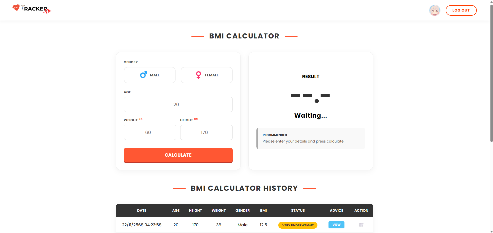
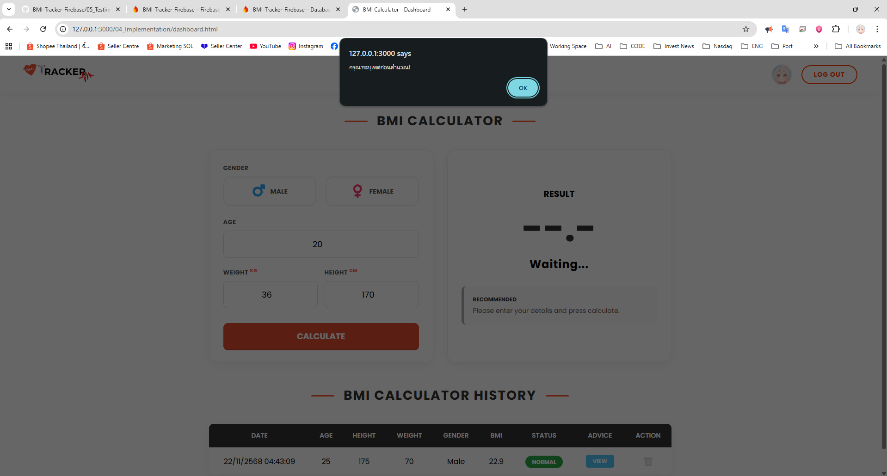
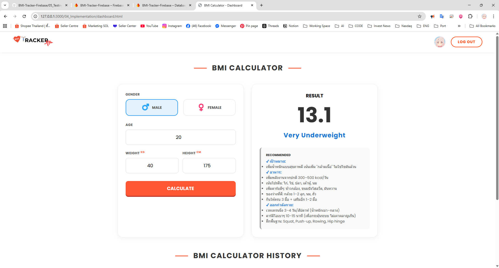
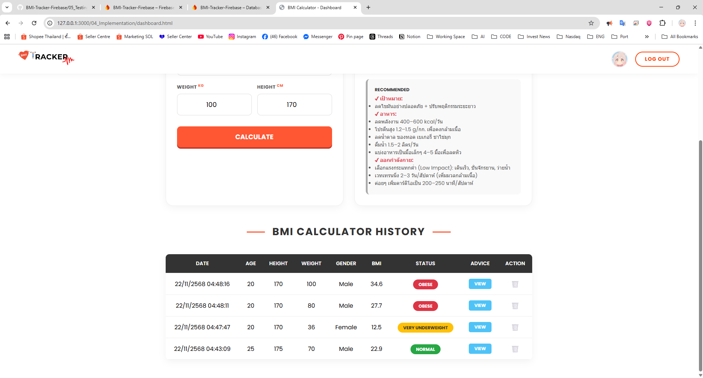

# รายงานการทดสอบระบบ (Test Case Report)
**Project Name:** BMI Tracker Firebase
**Date:** 22/11/2025
**Tester Person 1 :** [Natchanon Saileamonpiwat]
**Tester Person 2 :** [Jeerapat Watcharamoon]

## สรุปผลการทดสอบ (Test Summary)
| Test Case ID | Description (รายละเอียดการทดสอบ) | Type (ประเภท) | Status (สถานะ) |
| :--- | :--- | :--- | :--- |
| TC-01 | ทดสอบการเข้าสู่ระบบด้วย Google | Functional | ✅ Pass |
| TC-02 | ทดสอบการคำนวณ BMI ด้วยข้อมูลปกติ | Functional | ✅ Pass |
| TC-03 | ทดสอบกดคำนวณโดยไม่กรอกข้อมูล (Empty Input) | Error Handling | ✅ Pass |
| TC-04 | ทดสอบกดคำนวณโดยไม่เลือกเพศ | Error Handling | ✅ Pass |
| TC-05 | ทดสอบการบันทึกข้อมูลลงตารางและ Firebase | Data/Database | ✅ Pass |
| TC-06 | ทดสอบการแสดงผลคำแนะนำ (Advice Modal) | UI/UX | ✅ Pass |
| TC-07 | ทดสอบการลบข้อมูล (Delete) | Functional | ✅ Pass |
| TC-08 | ทดสอบการแสดงผลบนหน้าจอมือถือ (Responsive) | UI/UX | ✅ Pass |
| TC-09 | ทดสอบค่า BMI ต่ำกว่าเกณฑ์ (ผอมมาก) | Boundary | ✅ Pass |
| TC-10 | ทดสอบการออกจากระบบ (Logout) | Functional | ✅ Pass |

---

## รายละเอียดการทดสอบ (Test Details)

### 1. การจัดการผู้ใช้ (Authentication)

**TC-01: ทดสอบการเข้าสู่ระบบด้วย Google**
* **Pre-condition:** อยู่ที่หน้า Login (index.html)
* **Input:** กดปุ่ม "Sign in with Google" และเลือกบัญชี Gmail
* **Expected Result:** ระบบพาไปที่หน้า Dashboard และแสดงรูปโปรไฟล์มุมขวาบนถูกต้อง
* **Actual Result:** เข้าสู่ระบบได้สำเร็จและแสดงรูปโปรไฟล์ -> **Pass**
* **Evidence:** 
* **Evidence:** 

**TC-10: ทดสอบการออกจากระบบ (Logout)**
* **Pre-condition:** ผู้ใช้งานเข้าสู่ระบบแล้ว และอยู่ที่หน้า Dashboard
* **Input:** กดปุ่ม **LOG OUT** ที่มุมขวาบนของหน้าจอ
* **Expected Result:** ระบบต้องพาผู้ใช้กลับไปที่หน้า Login (หน้าแรก) และไม่สามารถกด Back กลับมาหน้า Dashboard ได้โดยไม่ล็อกอินใหม่
* **Actual Result:** ระบบเด้งกลับไปหน้า Login สำเร็จ -> **Pass**
* **Evidence:** 

---

### 2. การคำนวณ (Calculation Logic & Error Handling)

**TC-02: ทดสอบการคำนวณ BMI ด้วยข้อมูลปกติ**
* **Input:** เพศ: Male, อายุ: 25, น้ำหนัก: 70, ส่วนสูง: 175
* **Expected Result:** ได้ค่า BMI ประมาณ 22.9 และสถานะเป็น "Normal (ปกติ)" สีเขียว
* **Actual Result:** คำนวณได้ถูกต้องตามสูตร -> **Pass**
* **Evidence:** 

**TC-03: ทดสอบกดคำนวณโดยไม่กรอกข้อมูล**
* **Input:** ปล่อยช่องน้ำหนักและส่วนสูงว่าง แล้วกด Calculate
* **Expected Result:** มีข้อความแจ้งเตือน (Alert) ว่า "กรุณากรอกข้อมูลให้ครบ!"
* **Actual Result:** มี Alert เด้งขึ้นมาแจ้งเตือนถูกต้อง -> **Pass**
* **Evidence:** 

**TC-04: ทดสอบกดคำนวณโดยไม่เลือกเพศ**
* **Input:** กรอกน้ำหนักและส่วนสูงครบ แต่ **ไม่กดเลือกเพศ** แล้วกด Calculate
* **Expected Result:** มีข้อความแจ้งเตือน (Alert) ว่า "กรุณาระบุเพศก่อนคำนวณ!"
* **Actual Result:** มี Alert เด้งขึ้นมาแจ้งเตือนถูกต้อง -> **Pass**
* **Evidence:** 

**TC-09: ทดสอบค่าขอบเขตต่ำ (Boundary Check - ผอมมาก)**
* **Input:** กรอกน้ำหนัก 40, ส่วนสูง 175 (เพื่อให้ BMI ต่ำกว่า 18.5)
* **Expected Result:** BMI < 18.5, สถานะ "ผอมมาก", สีของข้อความ/ปุ่มต้องเป็น **สีน้ำเงิน**
* **Actual Result:** แสดงผลสีน้ำเงินและเกณฑ์ผอมมากถูกต้อง -> **Pass**
* **Evidence:** 

---

### 3. การจัดการข้อมูล (Database & History)

**TC-05: ทดสอบการบันทึกข้อมูล**
* **Input:** กดคำนวณสำเร็จ (จาก TC-02 หรือ TC-09)
* **Expected Result:** ข้อมูลใหม่ต้องปรากฏในตาราง History ทันที (Real-time) โดยอยู่บรรทัดบนสุด และมีวันที่/เวลาถูกต้อง
* **Actual Result:** ข้อมูลแสดงในตารางทันทีหลังคำนวณเสร็จ -> **Pass**
* **Evidence:** 

**TC-07: ทดสอบการลบข้อมูล**
* **Input:** กดปุ่มรูปถังขยะ 🗑️ ที่รายการแถวแรก และกด OK ยืนยัน
* **Expected Result:** รายการแถวแรกหายไปจากตารางทันที
* **Actual Result:** รายการถูกลบออกไปจริง -> **Pass**
* **Evidence:** 

---

### 4. การแสดงผล (UI/UX)

**TC-06: ทดสอบการแสดงผลคำแนะนำ (Advice Modal)**
* **Input:** กดปุ่ม **VIEW** สีฟ้า ที่รายการประวัติ
* **Expected Result:** หน้าต่าง Modal เด้งขึ้นมา แสดงคำแนะนำแบบละเอียด (มีหัวข้อและ Bullet points)
* **Actual Result:** Modal แสดงผลสวยงามและอ่านง่าย -> **Pass**
* **Evidence:** 

**TC-08: ทดสอบการแสดงผลบนหน้าจอมือถือ (Responsive)**
* **Input:** ปรับขนาดหน้าจอ Browser ให้เล็กลงเท่ามือถือ (หรือใช้ DevTools Mode iPhone)
* **Expected Result:** การจัดวางเปลี่ยนเป็นแนวตั้ง (Stack), ตารางสามารถเลื่อนซ้าย-ขวาได้ไม่ล้นจอ
* **Actual Result:** หน้าจอแสดงผลบนมือถือได้ดี ไม่พัง -> **Pass**
* **Evidence:** 
