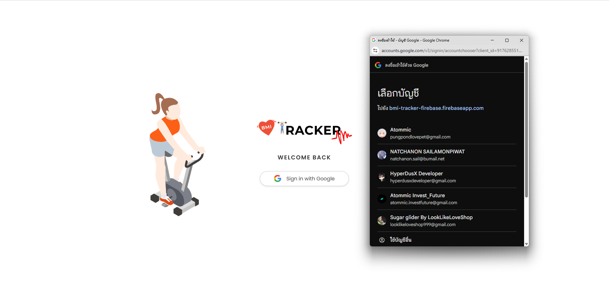

# คู่มือการใช้งาน (User Manual) - BMI Tracker

ยินดีต้อนรับสู่ **BMI Tracker Firebase** เว็บแอปพลิเคชันสำหรับคำนวณและติดตามดัชนีมวลกาย (BMI) ของคุณ เพื่อสุขภาพที่ดีและแข็งแรง

---

## 1. การเข้าใช้งาน (Login)
ระบบรองรับการเข้าสู่ระบบผ่าน **Google Account** เพื่อความสะดวกและปลอดภัย ข้อมูลของคุณจะถูกเก็บแยกเป็นส่วนตัว

1.  เมื่อเข้าสู่หน้าแรก จะพบกับหน้าต้อนรับ
2.  คลิกที่ปุ่ม **"Sign in with Google"**
3.  เลือกบัญชี Gmail ที่ต้องการใช้งาน
4.  เมื่อล็อกอินสำเร็จ ระบบจะพาเข้าสู่หน้า Dashboard ทันที

*(รูปประกอบ: หน้าจอเข้าสู่ระบบ)*

---

## 2. การคำนวณหาค่า BMI
เมื่อเข้าสู่หน้า Dashboard คุณสามารถเริ่มคำนวณได้ทันที:

1.  **เลือกเพศ (Gender):** คลิกที่ปุ่ม **Male** (ชาย) หรือ **Female** (หญิง)
2.  **ระบุอายุ (Age):** กรอกอายุของคุณ (ปี)
3.  **ระบุน้ำหนักและส่วนสูง:**
    * น้ำหนัก (Weight) ในหน่วย **กิโลกรัม (kg)**
    * ส่วนสูง (Height) ในหน่วย **เซนติเมตร (cm)**
4.  กดปุ่มสีส้ม **"CALCULATE"**

---

## 3. การอ่านผลลัพธ์ (Result & Advice)
ระบบจะแสดงผลลัพธ์ที่ด้านขวาของหน้าจอ ประกอบด้วย:

* **ตัวเลข BMI:** ค่าดัชนีมวลกายของคุณ
* **สถานะ (Status):** บอกเกณฑ์รูปร่างของคุณ ซึ่งจะมีสีแตกต่างกัน:
    * 🔵 **สีน้ำเงิน:** Very Underweight
    * 🔵 **สีฟ้า:** Underweight
    * 🟢 **สีเขียว:** Normal
    * 🟡 **สีเหลือง:** Overweight
    * 🔴 **สีแดง:** Obese
* **คำแนะนำเบื้องต้น (Recommended):** ข้อความสรุปสั้นๆ เช่น เป้าหมาย อาหาร ออกกำลังกาย

---

## 4. ดูประวัติและคำแนะนำละเอียด (History & Tips)
ข้อมูลทุกครั้งที่คุณกดคำนวณ จะถูกบันทึกลงในตารางด้านล่างโดยอัตโนมัติ

* **ดูประวัติ:** ตารางจะเรียงลำดับจาก **ล่าสุด** ไปหาอดีต แสดงวันที่และเวลาที่บันทึก
* **ดูคำแนะนำสุขภาพ:** กดปุ่ม **"VIEW"** สีฟ้า เพื่อเปิดหน้าต่างคำแนะนำ (Health Advice) แบบละเอียด
    * จะมีข้อมูลเรื่อง **อาหารที่แนะนำ** และ **การออกกำลังกาย** ที่เหมาะสมกับเกณฑ์ BMI นั้นๆ

---

## 5. การลบข้อมูลและออกจากระบบ
* **ลบข้อมูล:** หากต้องการลบรายการใด ให้กดปุ่มรูป **ถังขยะ** 🗑️ ที่แถวนั้น แล้วกดยืนยัน
* **ออกจากระบบ:** กดปุ่ม **"LOG OUT"** ที่มุมขวาบนของหน้าจอ เพื่อกลับไปหน้าแรก

---

**หมายเหตุ:** แอปพลิเคชันนี้ต้องเชื่อมต่ออินเทอร์เน็ตเพื่อใช้งาน (เนื่องจากมีการบันทึกข้อมูลลง Cloud Database)
