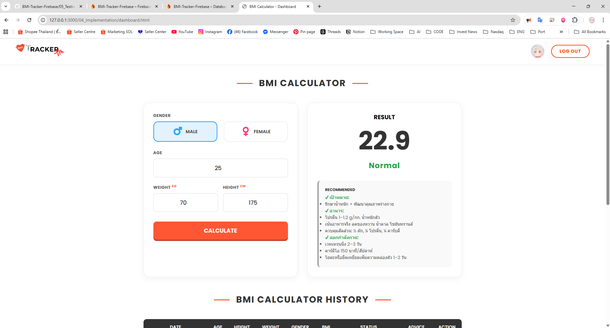
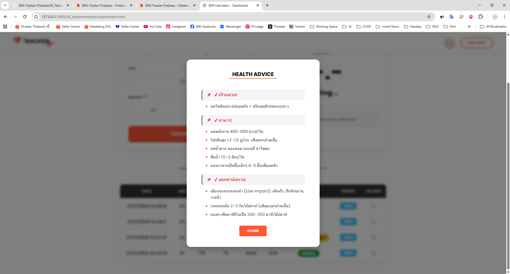

  
  
  <h1>BMI Tracker Firebase</h1>
  
  

    เว็บแอปพลิเคชันคำนวณค่า BMI และบันทึกประวัติสุขภาพ พัฒนาด้วย HTML/CSS/JS และ Firebase
  

  

    
    
  

 

## 📖 เกี่ยวกับโปรเจกต์
**BMI Tracker** คือโปรเจกต์รายวิชา Software Engineering ที่ให้นักศึกษาพัฒนาระบบตามขั้นตอน SDLC ตั้งแต่การออกแบบ จนถึงการเขียนโค้ดและใช้งานจริง

### ✨ ฟีเจอร์หลัก
- 🔐 **เข้าสู่ระบบง่าย:** ด้วย Google Sign-In
- 🧮 **คำนวณแม่นยำ:** พร้อมแปลผลเกณฑ์ BMI และให้คำแนะนำสุขภาพ
- ☁️ **บันทึกข้อมูล:** เก็บประวัติลง Firebase ดูย้อนหลังได้ไม่หาย
- 📱 **รองรับมือถือ:** ใช้งานได้ทั้งบนคอมและโทรศัพท์

---

## 📸 ภาพตัวอย่าง (Screenshots)

  
  

---

## 🎥 คลิปนำเสนอ (ยังไม่ได้อัพคลิป คับ เพราะ ตอนนี้ คิด แต่ไม่ _ ถึง คับ )

  

---

## 👥 ผู้จัดทำ

| รหัสนิสิต | ชื่อ-นามสกุล |
| **167070044** | **ณัฐชนนท์ ศิรมลพิวัฒน์** |
| **1670703162** | **จีรภัทร วัชรมูล** |
